## DOMAIN PROYEK
Industri baja menyumbang sekitar 8% dari total konsumsi energi akhir dunia dan memproduksi 7% – 8% emisi CO₂ global, sehingga peningkatan efisiensi energi di sektor ini sangat krusial untuk menurunkan jejak karbon dan biaya produksi [1], [2]. Di Korea Selatan, Korea Electric Power Corporation (KEPCO) menyediakan data konsumsi listrik industri secara harian, bulanan, dan tahunan melalui portal PCCS, yang menjadi sumber primer untuk analisis dan prediksi [3], [17].

Skala kecil pada pabrik baja seperti DAEWOO Steel Co. Ltd. di Gwangyang menunjukkan karakteristik beban yang fluktuatif (light, medium, maximum), serta variasi _reactive power_ (lagging/leading) dan power factor yang langsung memengaruhi utilitas energi nyata dan beban sistem listrik [4], [6]. Kompensasi _reactive power_ telah terbukti mengurangi losses dan biaya energi melalui peningkatan power factor, sehingga variabel ini menjadi komponen kunci dalam model prediksi [6], [11].

Berbagai studi menerapkan teknik data-mining dan machine learning untuk memprediksi konsumsi energi. Misalnya, model _linear regression_ dan _ensemble_ (CatBoost, Random Forest) berhasil menunjukkan akurasi tinggi pada dataset industri baja dengan ribuan instance dimana CO₂ dan _reactive power_ menjadi fitur dominan [5], [8], [13]. Penelitian oleh Sathishkumar V. E. dkk. (2021) di lingkungan _smart city_ juga membuktikan efektivitas model prediksi dalam mendukung penghematan energi dan perencanaan kapasitas [6].

Proyek ini bertujuan untuk mengembangkan model prediksi konsumsi energi pada industri baja skala kecil di Gwangyang, Korea Selatan dengan memanfaatkan variabel-variabel listrik (real/_reactive power_, power factor), emisi CO₂, serta karakteristik beban harian seperti _NSM_, _WeekStatus_, _Day_of_week_, dan _Load_Type_. Dengan prediksi yang akurat, perusahaan dapat menerapkan strategi pengelolaan energi proaktif, menurunkan biaya operasional, mematuhi regulasi lingkungan, dan meningkatkan keberlanjutan operasional.


## BUSINESS UNDERSTANDING

### Problem Statements
1. Bagaimana mengidentifikasi fitur yang paling berpengaruh terhadap variabel target Usage_kWh dalam dataset Steel Industry Energy Consumption?
2. Bagaimana membandingkan performa tiga pendekatan regresi berbeda yaitu berbasis jarak (KNN), ensemble bagging (Random Forest), dan ensemble boosting (Gradient Boosting) dalam memprediksi konsumsi energi?

### Goals
1. Mengidentifikasi fitur-fitur yang paling memengaruhi variabel Usage_kWh melalui proses eksplorasi data, baik pada variabel numerik maupun kategorik.
2. Menilai dan membandingkan performa model KNN, Random Forest, dan Gradient Boosting dalam memprediksi Usage_kWh menggunakan metrik evaluasi regresi berupa _Mean Squared Error_ (MSE) dan koefisien determinasi (R²).

### Solution Statements
1. Mengidentifikasi dan menangani data jika terdapat data yang hilang, outlier, nilai yang tidak sesuai, inkonsistensi, atau tipe data yang tidak sesuai.
2. Melakukan eksplorasi data secara univariat dan multivariat untuk memahami pola dan hubungan antar variabel, serta mengidentifikasi fitur numerik dan kategorik yang paling berpengaruh terhadap variabel Usage_kWh, dan mengidentifikasi variabel fitur yang saling berkorelasi kuat.
3. Melakukan preprocessing pada data untuk mempersiapkan input model dengan melakukan encoding fitur kategorik, melakukan reduksi dimensi pada variabel fitur yang saling berkorelasi, memisahkan data latih dan uji, serta melakukan normalisasi supaya rentang pada data numerik tidak jauh.
4. Melakukan modeling dengan membandingkan tiga jenis model yaitu berbasis jarak, bagging ensemble, dan boosting ensemble untuk melihat perbandingan kekuatan model terhadap data.
5. Melakukan evaluasi model regresi menggunakan metrik _Mean Squared Error_ (MSE) untuk membandingkan seberapa besar kesalahan prediksi terhadap data asli dan koefisien determinasi (R²) untuk membandingkan seberapa baik model dalam menangkap pola pada data.


## DATA UNDERSTANDING
Data berasal dari UCI Machine Learning Repository dalam dataset Steel Industry Energy Consumption yang berisi 35.040 instance dan 11 variabel. Dataset ini berasal dari perusahaan DAEWOO Steel Co. Ltd di Gwangyang, Korea Selatan. Dataset ini memuat rekaman konsumsi energi setiap 15 menit selama satu tahun dan dapat diunduh di UCI:
[UCI Machine Learning Repository] (https://archive.ics.uci.edu/dataset/851/steel+industry+energy+consumption).

### Variabel-variabel pada dataset adalah sebagai berikut:
1. date (datetime) - Timestamp setiap 15 menit
2. Usage_kWh (continuous) - Konsumsi energi industri (kWh), sebagai target.
3. Lagging_Current_Reactive.Power_kVarh (continuous) - Reactive power tercatat lagging (kVarh).
4. Leading_Current_Reactive_Power_kVarh (continuous) - Reactive power tercatat leading (kVarh).
5. CO2(tCO2) (continuous) - Emisi CO₂ dalam satuan ton per ton coil (ppm).
6. Lagging_Current_Power_Factor (continuous) - Power factor lagging (%).
7. Leading_Current_Power_Factor (continuous) - Power factor leading (%).
8. NSM (integer) - Number of seconds after midnight, mewakili siklus harian.
9. WeekStatus (categorical) - Status hari: 0 = weekend, 1 = weekday.
10. Day_of_week (categorical) - Hari dalam seminggu (Sunday-Saturday).
11. Load_Type (categorical) - Kategori beban: Light, Medium, atau Maximum. 

### Eksplorasi Data (EDA)
Identifikasi tipe data dan nilai yang hilang menggunakan:
```h
data.info()
```
| Column Name                            | Non-Null Count | Dtype   |
|----------------------------------------|----------------|---------|
| Date                                   | 35040          |datetime64|
| Usage_kWh                              | 35040          | float64 |
| Lagging_Current_Reactive_Power_kVarh   | 35040          | float64 |
| Leading_Current_Reactive_Power_kVarh   | 35040          | float64 |
| CO2(tCO2)                              | 35040          | float64 |
| Lagging_Current_Power_Factor           | 35040          | float64 |
| Leading_Current_Power_Factor           | 35040          | float64 |
| NSM                                    | 35040          | int64   |
| WeekStatus                             | 35040          | object  |
| Day_of_week                            | 35040          | object  |
| Load_Type                              | 35040          | object  |

> Data lengkap tidak ada nilai yang hilang. Begitu juga tipe data sesuai dengan tiap variabel.

Melihat statistika deskriptif pada data menggunakan:
```h
data.describe()
```
| Statistic | Usage_kWh | Lagging_CRP | Leading_CRP | CO2(tCO2) | Lagging_CPF | Leading_CPF | NSM        |
|-----------|-----------|---------------------------------------|----------------------------------------|-----------|-------------------------------|-------------------------------|------------|
| count     | 35040 | 35040                            | 35040                             | 35040 | 35040                     | 35040                     | 35040  |
| mean      | 27.386 | 13.035                            | 3.870                              | 0.011  | 80.578                     | 84.367                     | 42750  |
| std       | 33.444 | 16.306                            | 7.424                              | 0.016  | 18.921                     | 30.456                     | 24940  |
| min       | 0.000  | 0.000                             | 0.000                              | 0.000  | 0.000                      | 0.000                      | 0.000   |
| 25%       | 3.200  | 2.300                             | 0.000                              | 0.000  | 63.320                     | 99.700                     | 21375  |
| 50%       | 4.570  | 5.00                             | 0.000                              | 0.000  | 87.960                     | 100.000                    | 42750  |
| 75%       | 51.237 | 22.640                            | 2.090                              | 0.020  | 99.022                     | 100.000                    | 64125  |
| max       | 157.180| 96.910                            | 27.760                             | 0.070  | 100.000                    | 100.000                    | 85500  |

> Terdapat nilai 0 sebagai nilai minimum pada setiap variabel.

Identifikasi nilai 0 pada data menggunakan :
```h
data.loc[(data['fitur'] == 0)]
```
Identifikasi dan visualisasi outlier pada data menggunakan:
```h
import seaborn as sns

sns.boxplot(x = data['fitur'])
```

<div style="display: flex; gap: 10px;">
  
  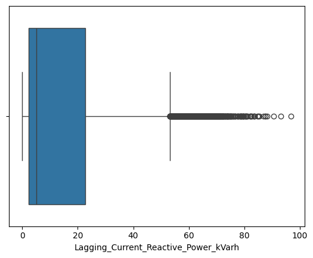
  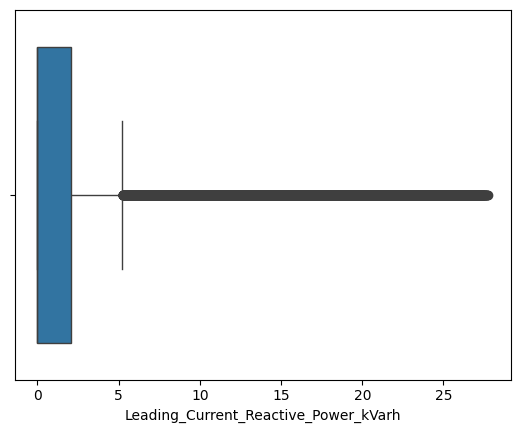
</div>
<div style="display: flex; gap: 10px;">
  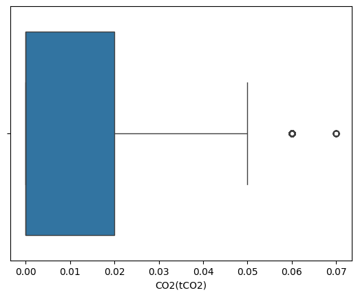
  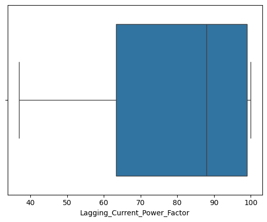
  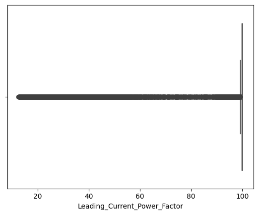
</div>

> Hampir semua variabel numerik memiliki outlier, namun karena nilai-nilai pada data merupakan nilai yang sebenarnya dalam domain, maka outlier akan dibiarkan sebagai data asli.

Analisis univariat menggunakan bar plot untuk jumlah dan persentase masing-masing kategori pada tiap variabel kategorik:
```h
import pandas as pd

categorical_features = ['kategorik_1', 'kategorik_2', 'kategorik_3']
feature = categorical_features[0]
count = data[feature].value_counts()
percent = 100*data[feature].value_counts(normalize=True)

df = pd.DataFrame({'jumlah sampel':count, 'persentase':percent.round(1)})
print(df)
count.plot(kind='bar', title=feature)
```
<div style="display: flex; gap: 10px;">
  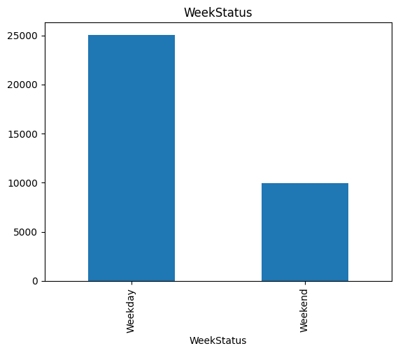
  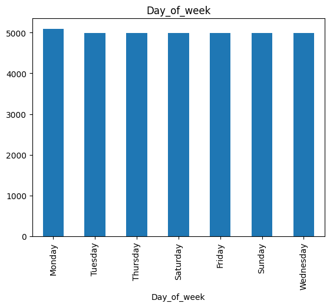
  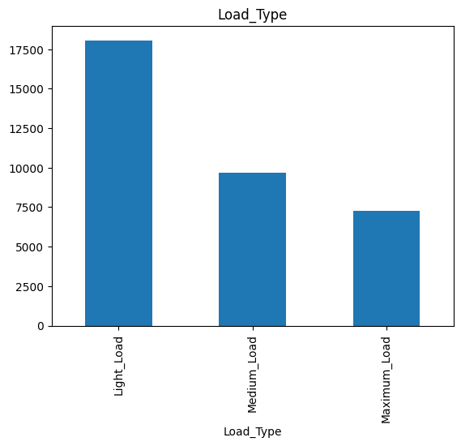
</div>

> Data diambil lebih banyak pada saat weekday ketimbang weekend, dengan jumlah data yang hampir sama banyaknya dari hari Senin sampai Jumat.

Kemudian histogram untuk melihat distribusi data pada tiap variabel numerik:
```h
import matplotlib.pyplot as plt

data.hist(bins=50, figsize=(20,15))
plt.show()
```


> Distribusi data pada masing-masing variabel tidak ada yang berdistribusi normal.

Analisis multivariat menggunakan bar plot untuk membandingkan antar variabel fitur kategorik dengan variabel target:
```h
cat_features = data.select_dtypes(include='object').columns.to_list()

for col in cat_features:
  sns.catplot(x=col, y="Usage_kWh", kind="bar", dodge=False, height = 4, aspect = 3,  data=data, palette="Set3")
  plt.title("Rata-rata 'Usage_kWh' Relatif terhadap - {}".format(col))
```


> Semua variabel kategorik berpengaruh terhadap variabel _Usage_kWh_. Konsumsi energi industri pada saat weekday terlihat lebih tinggi daripada saat weekend (sabtu dan minggu).

- Pairplot:
```h
sns.pairplot(data, diag_kind = 'kde')
```


> Variabel _Lagging_Current_Reactive_Power_kVarh_ dan variabel _CO2(tCO2)_ berkorelasi terharap variabel _Usage_kWh_.

- Heatmap:
```h
plt.figure(figsize=(10, 8))
correlation_matrix = data[numerical_features].corr().round(2)
sns.heatmap(data=correlation_matrix, annot=True, cmap='coolwarm', linewidths=0.5, )
plt.title("Correlation Matrix untuk Fitur Numerik ", size=20)
```


 Terdapat variabel-variabel fitur yang saling berkorelasi kuat seperti:
 1. Variabel _Leading_Current_Reactive_Power_kVarh_ dan variabel _Leading_Current_Power_Factor_.
 2. Variabel _CO2(tCO2)_ dan variabel _Lagging_Current_Reactive_Power_kVarh_

> Variabel numerik yang paling berpengaruh terhadap variabel target adalah _Lagging_Current_Reactive_Power_kVarh_ dan _CO2(tCO2)_.

## DATA PREPARATION

### Encoding Data Kategorik
Melakukan encoding data kategorik menjadi numerik menggunakan one-hot encoding dengan tujuan supaya data berbentuk kategori dapat diterima dan dibaca oleh komputer. Menggunakan one-hot dengan tujuan agar tidak terdapat asumsi berurut pada kategori:
```h
data = pd.concat([data, pd.get_dummies(data[categorical_features[0]], prefix='WeekStatus')],axis=1)
data = pd.concat([data, pd.get_dummies(data[categorical_features[1]], prefix='Day_of_week')],axis=1)
data = pd.concat([data, pd.get_dummies(data[categorical_features[2]], prefix='Load_Type')],axis=1)

data.drop(['WeekStatus','Day_of_week','Load_Type'], axis=1, inplace=True)
data = data.replace({True: 1, False: 0})
```

### Reduksi Dimensi
Reduksi dimensi menggunakan principal component analysis dengan tujuan mereduksi dan mengambil representasi komponen dari 2 variabel numerik fitur yang saling berkorelasi kuat:
```h
from sklearn.decomposition import PCA

pca = PCA(n_components=1, random_state=123)
pca.fit(data[['fitur_1','fitur_2']])
data['dimension_1'] = pca.transform(data.loc[:, ('fitur_1','fitur_2')]).flatten()
data.drop(['fitur_1','fitur_2'], axis=1, inplace=True)
```
> 1. Menghilangkan korelasi antar variabel fitur dengan reduksi dimensi menggunakan PCA pada variabel _Lagging_Current_Reactive_Power_kVarh_ dan _CO2(tCO2)_ kemudian mengambil satu principal component sebagai representasi dari dua fitur tersebut dengan nama _dimension_1_.
> 2. Menghilangkan korelasi antar variabel fitur dengan reduksi dimensi menggunakan PCA pada _Leading_Current_Reactive_Power_kVarh_ dan _Leading_Current_Power_Factor_ kemudian mengambil satu principal component sebagai representasi dari dua fitur tersebut dengan nama _dimension_2_.

### Split Data Latih dan Uji
Melakukan pemisahan data latih dan data uji sebesar 90:10 dengan tujuan memisahkan data latih dan uji supaya tidak ada kebocoran data. Data uji hanya 10% karena jumlah data yang banyak yaitu sekitar 35000 data. Dengan 10% nya sudah dapat data uji yang cukup dan bervariasi:
```h
from sklearn.model_selection import train_test_split

X = data.drop(["Usage_kWh"],axis =1)
y = data["Usage_kWh"]
X_train, X_test, y_train, y_test = train_test_split(X, y, test_size = 0.1, random_state = 123)
```

### Normalisasi Data
Melakukan normalisasi rentang nilai 0 sampai 1 pada data numerik dan data hasil reduksi dimensi untuk memastikan rentang pada data numerik tidak terlalu jauh sehingga meningkatkan akurasi dan stabilitas pada model, terutama model berbasis jarak seperti K-Neirest_neighbor:
```h
numerical_features = ['numerik_1', 'numerik_2', 'dimension_1', 'dimension_2']
scaler = MinMaxScaler()

scaler.fit(X_train[numerical_features])
X_train[numerical_features] = scaler.transform(X_train.loc[:, numerical_features])
X_train[numerical_features].head()
```


## MODELING
Dalam tugas regresi, penting untuk mengevaluasi beberapa algoritma yang berbeda dengan tujuan untuk memahami bagaimana masing-masing model menangani pola dalam data. Diantaranya terdapat tiga model populer yang sering digunakan seperti model berbasis jarak (KNN), model berbasis bagging (Random Forest), dan model berbasis boosting (Gradient Boosting). Ketiganya menawarkan pendekatan yang berbeda dalam memodelkan hubungan antara fitur dan target, serta memiliki kekuatan dan kelemahannya masing-masing.

### K-Nearest Neighbor Regressor
KNN Regressor merupakan algoritma yang sangat sederhana dan intuitif. Model ini bekerja dengan menghitung rata-rata nilai target dari k-tetangga terdekat. Meskipun mudah digunakan dan tidak memerlukan pelatihan eksplisit, KNN memiliki kelemahan besar ketika diterapkan pada dataset besar. Proses pencarian tetangga terdekat menjadi mahal secara komputasi, dan kinerjanya menurun drastis jika terdapat banyak fitur atau outlier. Model ini juga sangat sensitif terhadap distribusi data dan skala fitur.
```h
from sklearn.neighbors import KNeighborsRegressor

knn = KNeighborsRegressor(
    n_neighbors=5,
    weights='uniform',
    metric='minkowski',
    p=2
)
knn.fit(X_train, y_train)
```
> Membangun model menggunakan fungsi dari _scikit-learn_ yaitu _KNeighborsRegressor_ dengan:
> - Jumlah tetangga terdekat yang dipertimbangkan untuk prediksi sebanyak 5 (n_neighbors = 5)
> - Cara memberikan bobot yaitu semua tetangga memiliki bobot yang sama (weights = 'uniform')
> - Fungsi jarak yang digunakan adalah Minkowski (metric = 'minkowski')
> - parameter untuk metrik yaitu menggunakan euclidean distance (p = 2)
> - Kemudian menerapkan model pada data train X (fitur) dan y (target) menggunakan fungsi _fit()_.

### Random Forest Regressor
Random Forest adalah metode ensemble berbasis pohon keputusan yang membuat banyak pohon dan menggabungkan prediksinya. Model ini cukup tangguh terhadap outlier dan overfitting karena mengandalkan voting dari banyak pohon acak. Random Forest juga dapat menangani data besar dan fitur non-linear dengan baik. Namun, kelemahannya adalah interpretasi model yang lebih sulit dan potensi konsumsi memori dan waktu yang cukup besar saat jumlah pohon sangat banyak. Meski begitu, model ini cenderung stabil dan andal dalam banyak kasus.
```h
from sklearn.ensemble import RandomForestRegressor

rf = RandomForestRegressor(
    n_estimators=100,
    criterion='squared_error',
    max_depth=None,
    min_samples_split=2,
    min_samples_leaf=1,
    max_features=1.0,
    bootstrap=True,
    random_state=42,
)
rf.fit(X_train, y_train)
```
> Membangun model menggunakan fungsi dari _scikit-learn_ yaitu _RandomForestRegressor_ dengan:
> - Jumlah pohon yang digunakan sebanyak 100 pohon (n_estimators = 100)
> - Fungsi loss yang digunakan untuk split adalah _Mean Squared Error_ (criterion = 'squared_error')
> - Pohon akan tumbuh sampai daun murni (max_depth = None)
> - Jumlah minimum sampel yang dibutuhkan untuk membagi node sebanyak 2 (min_samples_split = 2)
> - Jumlah minimum sampel pada setiap daun sebanyak 1 (min_samples_leaf = 1)
> - Jumlah fitur maksimum yang dipertimbangkan saat mencari split terbaik sebanyak 1 (max_features = 1.0)
> - Data diambil dengan pengembalian saat melatih pohon (bootstrap = True)
> - Mengontrol elemen acak dalam pelatihan (random_state = 42)
> - Kemudian menerapkan model pada data train X (fitur) dan y (target) menggunakan fungsi _fit()_.

### Gradient Boosting Regressor
Gradient Boosting adalah model yang sangat kuat untuk regresi dengan akurasi tinggi. Model ini membangun pohon secara bertahap, di mana tiap pohon baru memperbaiki kesalahan dari pohon sebelumnya. Gradient Boosting efektif dalam mendeteksi pola kompleks dan interaksi antar fitur. Namun, ia cenderung lebih sensitif terhadap outlier dan noise, serta membutuhkan tuning parameter yang hati-hati agar tidak overfit. Proses pelatihannya juga cenderung lebih lambat dibanding Random Forest, terutama pada dataset besar.
```h
from sklearn.ensemble import GradientBoostingRegressor

gb = GradientBoostingRegressor(
    loss='squared_error',
    learning_rate=0.1,
    n_estimators=100,
    min_samples_split=2,
    min_samples_leaf=1,
    max_depth=3,
    max_features=None,
    random_state=42
)
gb.fit(X_train, y_train)
```
> Membangun model menggunakan fungsi dari _scikit-learn_ yaitu _GradientBoostingRegressor_ dengan:
> - Fungsi loss yang digunakan untuk optimasi adalah _Mean Squared Error_ (loss = 'squared_error')
> - Membuat model belajar dengan mengontrol kontribusi setiap pohon terhadap prediksi akhir (learning_rate = 0.1)
> - Jumlah pohon yang akan dibangun secara berurutan sebanyak 100 pohon (n_estimators = 100)
> - Jumlah minimum sampel untuk memecah node sebanyak 2 (min_samples_split = 2)
> - Jumlah minimum sampel yang harus dimiliki oleh daun sebanyak 1 (min_samples_leaf = 1) 
> - Kedalaman maksimum tiap pohon sedalam 3 (max_depth = 3)
> - Menggunakan semua fitur saat mencari split terbaik di setiap node (max_features = None) 
> - Mengontrol elemen acak dalam pelatihan (random_state = 42)
> - Kemudian menerapkan model pada data train X (fitur) dan y (target) menggunakan fungsi _fit()_.

Dalam regresi dengan data yang besar dan banyak outlier, Random Forest secara teori adalah pilihan terbaik dibandingkan dengan KNN dan Gradient Boosting. KNN tidak efisien untuk data besar dan sangat sensitif terhadap outlier karena bergantung pada perhitungan jarak. Model Gradient Boosting akurat namun kompleks, sensitif terhadap noise, dan memerlukan tuning yang rumit. Di sisi lain, model Random Forest stabil, tahan terhadap outlier, dan bekerja baik pada dataset besar tanpa banyak penyesuaian. Kombinasi ini yang menjadikannya model paling sesuai dengan kasus dataset ini.


## EVALUASI
Model regresi seperti K-Nearest Neighbors (KNN), Random Forest (RF), dan Gradient Boosting (GB) akan dievaluasi menggunakan metrik regresi yang umum, yaitu Mean Squared Error (MSE) dan R² (R square). Penggunaan kedua metrik ini memungkinkan evaluasi yang lebih menyeluruh terhadap performa masing-masing model dalam menyelesaikan tugas regresi.

### Mean Squared Error (MSE)
Mean Squared Error (MSE) digunakan untuk mengukur rata-rata kuadrat selisih antara nilai prediksi dan nilai aktual. Nilai ini menunjukkan tingkat kesalahan prediksi secara absolut dalam satuan kuadrat, sehingga semakin besar kesalahan maka semakin besar kontribusinya terhadap MSE. MSE dihitung dengan rumus:

<div style="display: flex; gap: 10px;">
  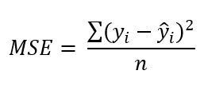
</div>

> - Pertama‑tama hitung residual, yaitu selisih antara nilai aktual dan nilai prediksi untuk setiap sampel. 
> - Selanjutnya kuadratkan setiap residual agar nilai negatif menjadi positif dan memberi bobot lebih besar pada deviasi yang besar. 
> - Terakhir, jumlahkan semua kuadrat residual dan bagi dengan jumlah sampel𝑛untuk mendapatkan MSE sebagai rata‑rata kuadrat error keseluruhan.

Dalam kasus ini, didapatkan nilai MSE berdasarkan data latih dan data uji. Nilai MSE paling besar baik saat latih dan uji ada pada hasil evaluasi pada model KNN, kedua adalah model Gradient Boosting, dan yang paling kecil adalah model Random Forest. Dalam hal ini artinya model Random Forest dapat memprediksi nilai konsumsi energi industri (Usage_kWh) paling baik atau mendekati nilai asli daripada model KNN dan Gradient Boosting.

| Model | Train MSE  | Test MSE   |
|-------|------------|------------|
| KNN   | 0.007980   | 0.013859   |
| RF    | 0.000117   | 0.000682   |
| GB    | 0.004342   | 0.004962   |

<div style="display: flex; gap: 10px;">
  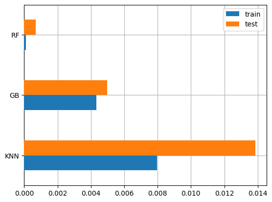
</div>

### Coefficient of Determination (R²)
R² (R square) atau koefisien determinasi mengukur seberapa baik model regresi mampu menjelaskan variansi atau keragaman nilai dalam data. Nilai R² berada dalam rentang 0 hingga 1, di mana:
- _R² = 1_ artinya model mampu menjelaskan 100% variansi dalam data, dimana berarti semua prediksi tepat.
- _R² = 0_  artinya model sama sekali tidak lebih baik dari rata-rata sederhana (mean) dalam memprediksi nilai target.

Semakin tinggi nilai R², semakin besar proporsi variasi pada data yang dapat dijelaskan oleh fitur input. Dengan kata lain, R² menunjukkan seberapa baik model menangkap pola yang ada dalam data, bukan hanya seberapa kecil kesalahan prediksinya. Karena itu, R² sangat berguna untuk menilai kekuatan penjelasan suatu model dalam konteks regresi. R² dihitung dengan rumus:

<div style="display: flex; gap: 10px;">
  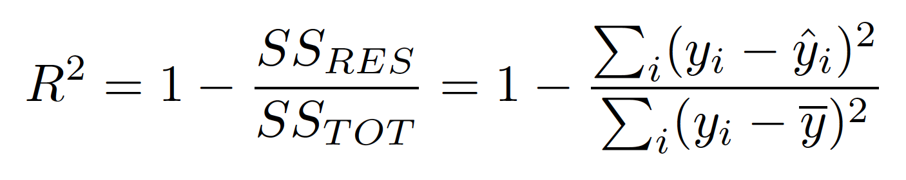
</div>

> - Pertama‑tama hitung _Total Sum of Squares_ (TSS) dengan menjumlahkan kuadrat selisih setiap nilai aktual terhadap rata‑ratanya untuk mengukur total variabilitas data.
> - Selanjutnya hitung Residual Sum of Squares (RSS) dengan menjumlahkan kuadrat selisih antara nilai aktual dan nilai prediksi yang enunjukkan variabilitas yang tidak dapat dijelaskan oleh model. 
> - Terakhir, bagi RSS dengan TSS untuk memperoleh fraksi variabilitas yang tidak terjelaskan, dan kurangkan dari 1.

Dalam kasus ini, didapatkan nilai R² berdasarkan data latih dan data uji. Nilai R² paling kecil baik saat latih dan uji ada pada hasil evaluasi pada model KNN, kedua adalah model Gradient Boosting, dan yang paling besar adalah model Random Forest. Dalam hal ini artinya model Random Forest dapat lebih efektif dalam memahami variansi data dan menghasilkan prediksi yang lebih akurat pada nilai konsumsi energi industri (Usage_kWh) d model KNN dan Gradient Boosting.

| Model | Train R²   | Test R²    |
|-------|------------|------------|
| KNN   | 0.992883   | 0.987314   |
| RF    | 0.999896   | 0.999376   |
| GB    | 0.996127   | 0.995458   | 

<div style="display: flex; gap: 10px;">
  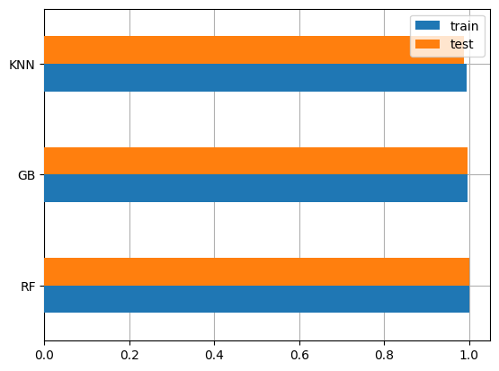
</div>

### Kesimpulan dan Dampak pada Bisnis
Solusi yang dikembangkan telah berhasil menjawab problem statements yang ditetapkan. Pertama, melalui EDA dan analisis korelasi, fitur Lagging_Current_Reactive_Power_kVarh dan CO2(tCO2) diidentifikasi sebagai variabel paling dominan yang memengaruhi konsumsi energi (Usage_kWh). Proses reduksi dimensi PCA juga berhasil menyederhanakan dua fitur berkorelasi menjadi dimension_1 dan dimension_2, sehingga validasi dan implementasi model menjadi lebih efektif.

Selanjutnya, semua goals yang diharapkan telah tercapai secara komprehensif. Goal pertama yakni identifikasi fitur kunci telah tercapai dengan jelas dengan didukung analisis univariat maupun multivariat. Goal kedua yaitu perbandingan performa model juga terpenuhi. Metrik MSE dan R² menunjukkan urutan hasil kinerja model yaitu: KNN < Gradient Boosting < Random Forest, dengan Random Forest sebagai model terbaik pada data latih maupun data uji.

Setiap solution statement yang direncanakan memberikan dampak pada kualitas dan keandalan model. Validasi pada data supaya tidak terdapat anomali yang mengakibatkan permasalahan ketika data dieksplorasi. Kemudian eksplorasi data mengidentifikasi hubungan antara fitur dan target pada data dengan baik, sementara PCA mencegah multikolinearitas dan menjaga kestabilan model. Metode One-hot Encoding mengonversi tiap kategori menjadi numerik dengan tujuan agar tidak terjadi asumsi urutan antar kategori serta sebagai persiapan input pelatihan model. Pembagian data sebesar 90:10 dan normalisasi skala pada data numerik membuat evaluasi menjadi lebih adil dan meningkatkan kinerja pada model. Terakhir, pemilihan dan evaluasi pada tiga algoritma regresi memberikan insight yang komprehensif dengan hasil yang menunjukkan bahwa Random Forest sebagai solusi optimal yang memungkinkan perusahaan untuk merencanakan strategi energi, mengoptimasi kompensasi reactive power, dan menurunkan emisi CO₂ secara proaktif.

### Referensi:

[1] International Energy Agency, “_Iron & Steel Technology Roadmap_,” IEA, 2020.

[2] International Energy Agency, “_Iron and Steel Analysis_,” IEA, Apr. 2024.

[3] UCI Machine Learning Repository, “_Steel Industry Energy Consumption_,” 2023.

[4] IEEE DataPort, “_Predictive energy consumption models for a smart small-scale steel industry in South Korea_,” 2021.

[5] A. Patel, B. Shah, et al., “_Power consumption prediction for steel industry_,” arXiv, Jul. 2023.

[6] S. V. E. Sathishkumar, C. Shin, Y. Cho, “_Efficient energy consumption prediction model for a data analytic-enabled industry building in a smart city_,” Building Research & Information, vol. 49, no. 1, pp. 127–143, 2021.

[7] Giant Electric, “_Benefits of Reactive Power Compensation for Industrial Applications_,” Jan. 2024.

[8] P. R. Kumar, S. Mehta, “_Predictive Modeling of Energy Consumption in the Steel Industry_,” International Journal of Research in CS, 2022.

[9] Institute for Energy Economics and Financial Analysis, “_Steel Fact Sheet_,” IEEFA, Jun. 2022.

[10] U.S. Energy Information Administration, “_Manufacturing Energy Consumption Survey (MECS): Steel_,” EIA, 2023.
